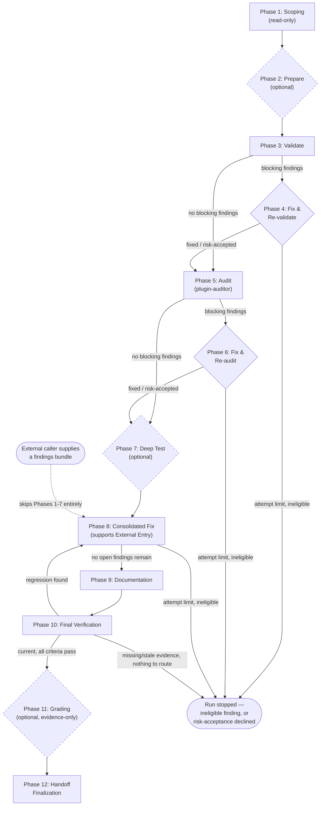

# Pipeline Diagram

Visual companion to `workflows/run-qa-pipeline.md`'s prose — the numbered phases, the
two Fix/Re-check loops, Phase 7/11's optional gates, Phase 8's External Entry shortcut,
and the Phase 10 → Phase 8 regression route.

**R18 exception (recorded):** the diagram below is ~36 lines, above the rulebook's
30-line Critical threshold — it's a single coherent flowchart covering all twelve
phases; splitting it across multiple fences would break the diagram's own edges, and
`scripts/` extraction doesn't apply since this is markup, not executable logic. This
file's entire purpose is being the dedicated extraction target R18 asks for — the
diagram isn't buried inline in `SKILL.md`'s own prose.

**Reading the loops:** Phase 4 and Phase 6 are re-entry points *within* Validate and
Audit respectively — they don't advance the phase counter past 5 or 7 until their own
Decision resolves. Phase 8 is the pipeline's single, later consolidation point for
anything still open from Validation, Audit, or Deep Test, **plus** a regression Phase 10
discovers on a later pass through the same run. External Entry
(dashed edge above) is the only path that can reach Phase 8 without ever running Phases
1-7 at all — see `SKILL.md`'s "External Entry" section for its own validation gate
before that edge is allowed to fire.

**Reading the dashed nodes:** Phase 2 (Prepare), Phase 7 (Deep Test), and Phase 11
(Grading) are the three explicit opt-in phases — see `SKILL.md`'s "Optional Phases"
section. Every other phase runs unconditionally once reached (though several may resolve
instantly to `not_needed` when there's nothing for them to do, e.g. Phase 4 when Phase 3
found no blocking findings).
